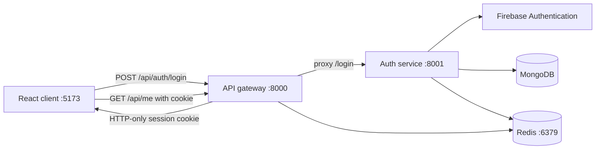
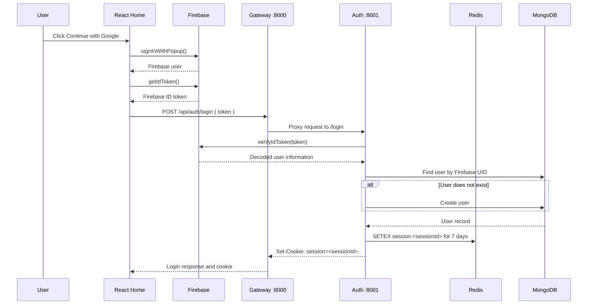

# Friday AI: Current Architecture

This document describes the application as it currently exists. It focuses on the basic Google login and session flow only.

## 1. Services



### Client-side

- Runs on `http://localhost:5173`.
- React renders `App`, which currently renders `Home`.
- Axios uses `http://localhost:8000` as its base URL.
- Axios has `withCredentials: true`, so browser cookies are sent with API requests.
- `Home` signs the user in with Google through Firebase's client SDK.

### Gateway

- Runs on `http://localhost:8000`.
- Allows requests from `http://localhost:5173` using CORS.
- Enables credentials so cookies can be used across the local frontend and gateway.
- Parses cookies with `cookie-parser`.
- Proxies `/api/auth/*` requests to the auth service at `http://localhost:8001`.
- Owns the protected `GET /api/me` endpoint.

### Auth service

- Runs on `http://localhost:8001`.
- Receives the proxied login request at `/login`.
- Verifies Firebase ID tokens with Firebase Admin SDK.
- Finds or creates the application user in MongoDB.
- Creates a session record in Redis.
- Returns a session cookie through the controller.

## 2. Login Flow



### Important detail

The client currently sends:

```ts
{ token }
```

The auth service currently reads `req.body.token`, so these names must stay aligned.

## 3. Checking the Current User

When `App` mounts:

1. `getCurrentUser()` sends `GET /api/me` to the gateway.
2. The browser includes the `session` cookie because Axios uses `withCredentials: true`.
3. Gateway middleware reads `req.cookies.session`.
4. Gateway looks up `session:<sessionId>` in Redis.
5. If found, the session data becomes `req.user`.
6. `/api/me` returns that user data.
7. If no valid cookie exists, the gateway returns `401 Unauthorized`.

At the moment, `App` calls `getCurrentUser()` but does not store its result or change the rendered page. It still renders `Home` in every case.

## 4. Responsibility Boundaries

| Layer | Responsibility |
| --- | --- |
| React `Home` | Start Google sign-in and send the Firebase token |
| Axios utility | Configure API base URL and credentials |
| Gateway CORS | Allow the browser origin and credentialed requests |
| Gateway proxy | Forward `/api/auth/*` to the auth service |
| Gateway auth middleware | Validate the application session in Redis |
| Auth controller | Read HTTP input, create cookie, return HTTP response |
| Auth service | Verify Firebase token and find/create the user |
| Firebase | Authenticate the Google identity and issue ID tokens |
| MongoDB | Persist application user records |
| Redis | Store temporary login sessions with expiration |

## 5. Local Configuration

### Client `.env`

```env
VITE_SERVER_URL=http://localhost:8000
```

### Gateway `.env`

```env
PORT=8000
AUTH_SERVICE_URL=http://localhost:8001
CLIENT_SIDE_URL=http://localhost:5173
REDIS_URL=redis://localhost:6379
```

### Auth service `.env`

```env
PORT=8001
MONGO_URI=<MongoDB connection string>
```

The auth service also needs access to `REDIS_URL` because its controller writes sessions to Redis.

## 6. Startup Order

1. Start Redis on port `6379`.
2. Start the auth service on port `8001`.
3. Start the gateway on port `8000`.
4. Start the client on port `5173`.
5. Open the client in the browser.

The browser should communicate with the gateway only. It should not call port `8001` directly.

## 7. Current Gaps to Address Later

- Store the result of `GET /api/me` in Redux or React state.
- Render a chat page for authenticated users instead of always rendering `Home`.
- Add logout handling in the client.
- Add a shared environment/configuration strategy for Redis.
- Move secrets such as the Firebase Admin service-account key out of the repository and load them securely from environment or secret management.
- Add validation for missing or invalid request bodies.
- Add centralized error handling and request logging.
